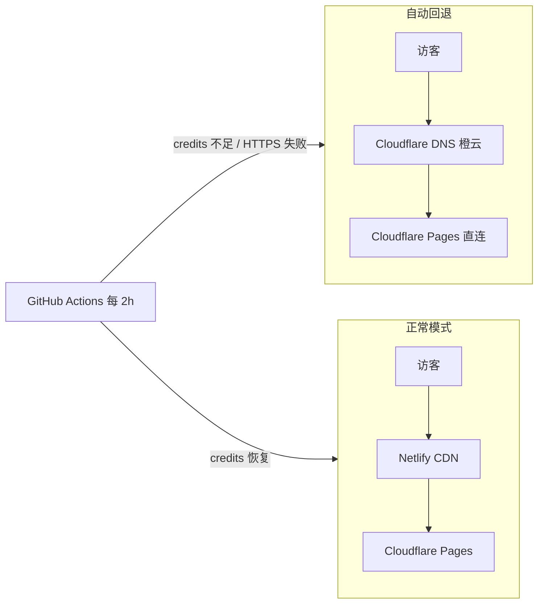

# Cloudflare + Netlify 双层部署的改造

这篇博客记录本站近期对 **Cloudflare Pages + Netlify 回源代理** 架构的一次改造：在保留 Netlify 作为可选 CDN 入口的前提下，大幅减少无意义的 deploy 消耗，并在额度用尽或 HTTPS 不可用时**通过 GitHub Actions 自动切回 Cloudflare 直连**——无需手动改 DNS 或 Pages 面板。

## 背景：原来的架构

本站采用「双层 CDN」：

```text
访客 → www.vedaru.cn（Netlify）
     → 200 回源代理 → vedarublog-github-io.pages.dev（Cloudflare Pages）
```

Netlify 侧几乎不托管真实内容，只生成一条 `_redirects` 规则，把所有请求转发到 Cloudflare Pages。真正的 Astro 构建与静态资源托管在 Cloudflare Pages 上完成。

这样设计的初衷是：Netlify 与 Cloudflare 各取所长。但运行一段时间后，暴露了几个问题。

## 遇到了什么问题

### 1. Netlify credits 消耗过快

Netlify 免费套餐每月约 300 credits，每次 production deploy 约 15 credits。仓库每次 push 都会触发 Netlify 构建，即使内容变更与代理层无关——19 次 deploy 就接近 285 credits。

### 2. 国内 HTTPS 超时

Netlify 边缘节点（`75.2.60.5:443`）在国内经常连不上，表现为 `ERR_TIMED_OUT`；而 Cloudflare Pages 源站 `*.pages.dev` HTTPS 正常。双层代理在可用性上反而更差。

### 3. credits 用尽后站点不可用

额度用尽后 Netlify 暂停站点，但 DNS 仍指向 Netlify，访客无法访问。需要一种**自动回退**机制，在 Netlify 不可用时切到 CF 直连。

## 改造方案概览

改造分两条线并行：

| 目标 | 实现 |
|------|------|
| 减少 deploy | `netlify.toml` + `scripts/netlify-should-build.mjs` |
| 自动切换流量 | `scripts/netlify-traffic-switch.mjs` + GitHub Actions |



## 一、跳过无意义的 Netlify deploy

在 `netlify.toml` 中配置 ignore 钩子：

```toml
[build]
  ignore = "node ./scripts/netlify-should-build.mjs"
  command = "node ./scripts/netlify-proxy-build.js"
  publish = "dist"
```

脚本逻辑很简单：用 `git diff` **只对比代理层文件**：

```text
netlify.toml
scripts/netlify-proxy-build.js
scripts/netlify-should-build.mjs
```

- 代理层无变更 → exit 0 → **跳过 deploy**
- 代理层有变更 → exit 1 → 执行 deploy

因此改文章、组件、`astro.config`、CI workflow 等**不会再触发 Netlify 构建**。若 credits 已用尽，还可在 Netlify UI → **Stop builds** 彻底停止自动构建。

## 二、GitHub Actions 自动切换 DNS

Workflow 文件：`.github/workflows/netlify-traffic.yml`

- **定时**：每 2 小时 `cron` 巡检（`mode=auto`，无需人工操作）
- **手动**：Actions → Netlify Traffic Switch → 可选 `cloudflare` / `netlify` / `dry_run`

核心脚本 `scripts/netlify-traffic-switch.mjs` 在 **auto 模式**下会：

1. 调用 Netlify API 估算本月 credits 剩余
2. 检测 Netlify 站点是否 paused
3. 探测 `https://www.vedaru.cn` HTTPS 是否可用
4. 满足切换条件时：
   - 通过 Cloudflare Pages API **注册** `www.vedaru.cn`（及 apex）
   - 修改 Cloudflare DNS：`www` CNAME → `vedarublog-github-io.pages.dev`，**强制橙云**
   - 同步 apex 记录
5. 将状态写入 `.github/netlify-traffic-state.json` 并 commit

### 切换条件

| 方向 | 条件 |
|------|------|
| Netlify → Cloudflare | credits 剩余 ≤ 45；或站点不可用；或 HTTPS 探测失败 |
| Cloudflare → Netlify | 当前在 CF 模式且 credits 剩余 > 105 |

### 所需 GitHub Secrets

| Secret | 说明 |
|--------|------|
| `CF_API_TOKEN` | Zone DNS Edit（vedaru.cn） |
| `CF_PAGES_API_TOKEN` | 可选；Account Cloudflare Pages Edit |
| `CF_ZONE_ID` | vedaru.cn Zone ID |
| `NETLIFY_AUTH_TOKEN` | Netlify Personal Access Token |
| `NETLIFY_SITE_ID` | Netlify Site ID |
| `NETLIFY_CNAME_TARGET` | 如 `xxx.netlify.app` |

Cloudflare API Token 需包含两类权限：

- **Zone → DNS → Edit**（改 CNAME / 开橙云）
- **Account → Cloudflare Pages → Edit**（注册自定义域名）

若只有 DNS 权限，脚本仍能改 DNS，但 Pages API 会报 `Authentication error`，站点可能持续 **522**——因为域名未在 Pages 项目激活。

也可将 Pages 权限合并进同一个 `CF_API_TOKEN`，或单独创建 `CF_PAGES_API_TOKEN`。

### 本地调试

```bash
# 只检查，不改 DNS
DRY_RUN=1 node scripts/netlify-traffic-switch.mjs

# 正式运行（需配置环境变量）
pnpm netlify-traffic
```

## 踩坑记录

### dry_run 误开启

GitHub Actions 的 boolean 输入在表达式里可能是字符串 `"false"`，对 `&&` 仍为 truthy。Workflow 已改为显式比较：

```yaml
DRY_RUN: ${{ (github.event.inputs.dry_run == true || github.event.inputs.dry_run == 'true') && '1' || '' }}
```

定时任务没有 `inputs`，`DRY_RUN` 为空 → **会真实改 DNS**。

### www 是 A 记录而非 CNAME

早期脚本只查 CNAME，而 `www.vedaru.cn` 实际是 A 记录指向 `75.2.60.5`。现已支持 A / CNAME / AAAA 互转。

### 522：DNS 改了但 Pages 未激活

切到 Cloudflare 后若 `www` 是**灰云**（DNS only），或 Pages 项目未添加 `www.vedaru.cn`，会返回 522。脚本现已：

- 注册 Pages 自定义域名
- 强制 `proxied: true`（橙云）
- 先改 DNS 再注册 Pages，避免 Pages API 失败时连 DNS 都不改

### Netlify ignore 脚本的 bug

缺 `CACHED_COMMIT_REF` 时若返回类型错误，Node 异常退出码为 1，Netlify 会误判为「需要构建」。已改为缺 ref 时默认 **skip**。

## 总结

| 改造前 | 改造后 |
|--------|--------|
| 每次 push 都 deploy，credits 快速耗尽 | 仅代理层变更才 deploy |
| credits 用尽 / HTTPS 故障需手动改 DNS | Actions 每 2h 自动切换 |
| 522 需手动开橙云、绑 Pages 域名 | 脚本 API 一键完成 |

整体成本仍为 **$0**：GitHub 公开仓库 Actions 免费、Cloudflare Pages 免费、Netlify 免费额度在跳过无意义 deploy 后足够维持代理层更新。

若你也在用类似的「Netlify 代理 + CF 源站」架构，可以参考本仓库的 `netlify.toml`、`.github/workflows/netlify-traffic.yml` 与 `scripts/` 下的两个脚本直接复用。
