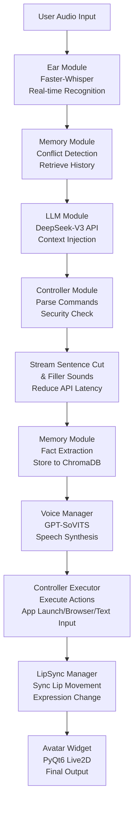
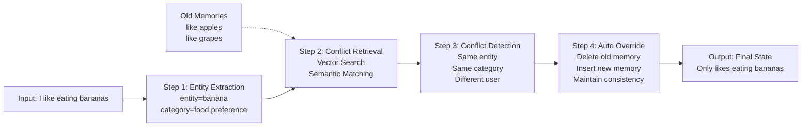

# Local: 基于 DeepSeek 与 混合架构的 AI 虚拟主播与电脑控制系统

::github{repo="Vedaru/Local-project"}

Local 是一个集成了语音识别 (ASR)、大语言模型 (LLM)、长期记忆系统 (RAG)、高质量语音合成 (TTS) 以及电脑控制功能的人工智能虚拟主播系统。本项目旨在构建一个类似 Neuro-sama 的数字生命，通过本地算力与云端 API 的混合驱动，实现在低延迟环境下的高智能互动，并支持自动化电脑操作。

## 🚀 技术架构 (Technical Stack)

本项目采用"云端大脑 + 本地感官 + 电脑控制"的混合架构，充分发挥 RTX 5060 显卡的本地推理能力：

*   **大脑 (Brain):** [DeepSeek-V3 (API)](https://www.deepseek.com/)
    *   负责核心对话逻辑、人设演绎及直播间互动。
*   **听觉 (Ear):** [Faster-Whisper (Local)](https://github.com/SYSTRAN/faster-whisper)
    *   基于本地显卡加速的语音转文字，实现毫秒级的语音指令接收。
*   **嘴巴 (Voice):** [GPT-SoVITS (Local)](https://github.com/RVC-Boss/GPT-SoVITS)
    *   本地部署的高质量情感语音合成，支持零样本声音克隆。
*   **记忆秘书 (Analyst):** [Qwen-Turbo (API)](https://help.aliyun.com/zh/model-studio/)
    *   负责从对话流中提炼关键事实，将短期记忆转化为结构化信息。
*   **长期记忆 (Memory):** [ChromaDB (Local)](https://www.trychroma.com/)
    *   本地向量数据库，存储海量历史对话事实，实现"永不忘记"的互动体验。
*   **身体 (Avatar):** [Live2DViewerEX](https://store.steampowered.com/app/616720/Live2DViewerEX/)
    *   跨平台的虚拟形象驱动端，支持桌面挂件模式与 API 联动。
*   **电脑控制 (Controller):** [PyAutoGUI + subprocess (Local)](https://pyautogui.readthedocs.io/)
    *   本地电脑自动化控制，支持应用启动、网页访问、文本输入、笔记保存等操作。

## 🛠️ 核心机制 (Key Mechanisms)

### 1. 记忆双轨制 (Memory Pipeline)
系统通过双层架构管理记忆：
- **短期记忆:** 维护最近 15 轮对话的上下文窗口。
- **长期记忆:** 当对话窗口溢出时，触发 `Qwen-Turbo` 提炼事实，并存入 `ChromaDB`。在回答前，系统会自动检索相关事实并注入 `DeepSeek-V3` 的提示词中。

### 2. 低延迟响应流
为了消除 AI 思考时的冷场，本项目实现了：
- **流式切句:** 实时检测 DeepSeek 输出的标点符号，实现“边想边读”。
- **填充音机制:** 在 API 请求期间随机播放“嗯...”、“我想想”等语气词音频。

### 3. 桌面联动
利用 Live2DViewerEX 的远程控制功能，AI 可以根据情绪标签（如 `[开心]`）自动切换表情，并实现在桌面上的置顶透明显示。

### 4. 电脑控制系统
通过模块化的电脑控制架构，实现安全的自动化操作：
- **安全守卫:** 白名单机制验证应用路径，防止恶意操作
- **动作执行器:** 支持应用启动、网页访问、文本输入、文件操作
- **智能解析:** LLM 自动解析用户指令并转换为具体操作

## 💻 硬件要求
显卡: NVIDIA GeForce RTX 5060 (笔记本版 8GB 显存) 或更高。
环境: CUDA 12.1 + cuDNN 8.9.x。
系统: Windows 10/11。
Python: 3.8+

---

## 📦 完整项目结构

```
Local-project/
├── .env                        # 环境变量配置 (API密钥等)
├── .gitattributes             # Git 配置
├── .gitignore                 # Git 忽略规则
├── config.yaml                # 主配置文件
├── main.py                    # 主入口文件 (文本模式)
├── main copy.py               # 主入口文件副本 (带语音识别)
├── README.md                  # 项目说明文档
├── requirements.txt           # Python 依赖列表
├── __pycache__/               # Python 缓存文件
├── assets/                    # 资源文件目录
│   ├── audio_ref/             # 参考音频文件
│   │   ├── ref_text.txt       # 参考音频对应的文本
│   └── web/                   # 前端资源
│       ├── viewer.html        # Avatar 查看器页面
│       ├── js/                # JavaScript 文件
│       └── models/            # 3D 模型文件
├── data/                      # 数据存储目录
│   ├── chroma_db/             # 向量数据库
│   │   ├── chroma.sqlite3     # ChromaDB 数据库文件
│   │   └── [collection_dirs]/ # 集合数据目录
│   ├── logs/                  # 日志文件
│   └── temp/                  # 运行时临时文件
├── GPT-SoVITS-v2pro-20250604-nvidia50/ # GPT-SoVITS 语音合成引擎
│   ├── api_v2.py              # API 接口 v2
│   ├── api.py                 # API 接口
│   ├── batch_inference.py     # 批量推理
│   ├── config.py              # 配置
│   ├── extra-req.txt          # 额外依赖
│   ├── go-webui.bat           # Windows 启动脚本
│   ├── go-webui.ps1           # PowerShell 启动脚本
│   ├── install.ps1            # PowerShell 安装脚本
│   ├── install.sh             # Linux 安装脚本
│   ├── LICENSE                # 许可证
│   ├── README.md              # GPT-SoVITS 说明
│   ├── requirements.txt       # 依赖列表
│   ├── webui.py               # Web 界面
│   ├── __pycache__/           # Python 缓存
│   ├── GPT_SoVITS/            # 核心模块
│   │   ├── download.py        # 下载工具
│   │   ├── export_torch_script_v3.py # TorchScript 导出
│   │   ├── inference_cli.py   # 命令行推理
│   │   ├── inference_gui.py   # GUI 推理
│   │   ├── inference_webui_fast.py # 快速 Web 推理
│   │   ├── inference_webui.py # Web 推理
│   │   ├── onnx_export.py     # ONNX 导出
│   │   ├── process_ckpt.py    # 检查点处理
│   │   ├── s1_train.py        # 第一阶段训练
│   │   ├── s2_train_v3_lora.py # 第二阶段 LoRA 训练
│   │   ├── s2_train_v3.py     # 第二阶段训练 v3
│   │   ├── s2_train.py        # 第二阶段训练
│   │   ├── stream_v2pro.py    # 流式推理 v2pro
│   │   ├── sv.py              # 语音变声
│   │   ├── utils.py           # 工具函数
│   │   ├── __pycache__/       # 缓存
│   │   ├── AR/                # 声学模型
│   │   ├── BigVGAN/           # 声码器
│   │   ├── configs/           # 配置文件
│   │   ├── eres2net/          # 编码器
│   │   ├── f5_tts/            # TTS 模型
│   │   ├── feature_extractor/ # 特征提取器
│   │   ├── module/            # 核心模块
│   │   ├── prepare_datasets/  # 数据集准备
│   │   ├── pretrained_models/ # 预训练模型
│   │   ├── text/              # 文本处理
│   │   └── TTS_infer_pack/    # TTS 推理包
│   ├── GPT_weights/           # GPT 模型权重
│   │   ├── GPT_weights_v2/    # v2 权重
│   │   │   └── luotianyi-e50.ckpt
│   │   ├── GPT_weights_v2Pro/ # v2Pro 权重
│   │   ├── GPT_weights_v2ProPlus/ # v2ProPlus 权重
│   │   ├── GPT_weights_v3/    # v3 权重
│   │   └── GPT_weights_v4/    # v4 权重
│   ├── logs/                  # GPT-SoVITS 日志
│   ├── output/                # 输出目录
│   │   ├── asr_opt/           # ASR 优化输出
│   │   ├── slicer_opt/        # 音频切片优化
│   │   └── uvr5_opt/          # UVR5 优化
│   ├── runtime/               # Python 运行时环境
│   │   ├── 2.0/               # Python 2.0 兼容
│   │   ├── Lib/               # 标准库
│   │   ├── Scripts/           # 脚本
│   │   └── ...                # 其他运行时文件
│   ├── SoVITS_weights/        # SoVITS 模型权重
│   │   ├── SoVITS_weights_v2/ # v2 权重
│   │   │   └── luotianyi_e16_s432.pth
│   │   ├── SoVITS_weights_v2Pro/ # v2Pro 权重
│   │   ├── SoVITS_weights_v2ProPlus/ # v2ProPlus 权重
│   │   ├── SoVITS_weights_v3/ # v3 权重
│   │   └── SoVITS_weights_v4/ # v4 权重
│   ├── TEMP/                  # 临时文件
│   └── tools/                 # 工具脚本
│       ├── __init__.py
│       ├── assets.py          # 资源管理
│       ├── audio_sr.py        # 音频超分辨率
│       ├── cmd-denoise.py     # 命令行降噪
│       ├── my_utils.py        # 自定义工具
│       ├── slice_audio.py     # 音频切片
│       ├── slicer2.py         # 音频切片器2
│       ├── subfix_webui.py    # WebUI 修复
│       ├── __pycache__/       # 缓存
│       ├── AP_BWE_main/       # 音频处理
│       ├── asr/               # 自动语音识别
│       ├── denoise-model/     # 降噪模型
│       ├── i18n/              # 国际化
│       └── uvr5/              # UVR5 音频分离
├── modules/                   # 核心模块目录
│   ├── __init__.py            # 模块初始化
│   ├── _patch_ctranslate2.py  # CTranslate2 补丁
│   ├── agent/                 # Agent 子模块（ReAct agent + 工具）
│   │   ├── __init__.py
│   │   ├── browser.py         # 浏览器 / 网页检索工具
│   │   ├── core.py            # Agent 核心逻辑（ReAct loop）
│   │   └── tools.py           # Agent 可用工具封装
│   ├── config.py              # 配置加载
│   ├── ear.py                 # 语音识别模块
│   ├── llm.py                 # LLM 接口模块
│   ├── logging_config.py      # 日志配置
│   ├── utils.py               # 工具函数
│   ├── voice.py               # 语音合成模块
│   ├── __pycache__/           # Python 缓存
│   ├── avatar/                # Avatar 子模块
│   │   ├── __init__.py
│   │   ├── click_through.py   # 点击穿透
│   │   ├── expression.py      # 表情管理
│   │   ├── js_communication.py # JS 通信
│   │   ├── lip_sync.py        # 口型同步
│   │   ├── logger.py          # 日志
│   │   ├── manager.py         # Avatar 管理器
│   │   ├── resize.py          # 窗口调整
│   │   ├── tray.py            # 系统托盘
│   │   ├── webengine.py       # WebEngine 集成
│   │   └── widget.py          # 主窗口组件
│   ├── controller/            # 电脑控制模块
│   │   ├── __init__.py
│   │   ├── core.py            # 控制核心
│   │   ├── executor.py        # 动作执行器
│   │   └── safety.py          # 安全守卫
│   └── memory/                # 记忆管理子模块
│       ├── __init__.py        # 记忆模块初始化
│       ├── analyzers.py       # 文本分析器
│       ├── config.py          # 记忆配置参数
│       ├── conflict/          # 冲突检测与覆盖模块
│       │   ├── __init__.py
│       │   ├── constants.py
│       │   ├── detector.py
│       │   ├── locator.py
│       │   ├── models.py
│       │   ├── resolver.py
│       │   └── utils.py
│       ├── core.py            # 核心记忆管理类
│       ├── logger.py          # 日志配置
│       ├── retrieval.py       # 记忆检索与去重
│       └── storage.py         # 存储层
└── temp/                      # 临时文件目录
```

## 📦 项目结构详解

### 核心模块 (modules/)

#### 1️⃣ **ear.py - 听觉模块**
```
功能: 实时语音识别 (ASR)
实现:
  - 基于 PyAudio + Faster-Whisper 的语音输入
  - 支持 CUDA 加速 (float16 精度)
  - 集成 RMS 静音检测 (VAD)
  - 支持内存处理或临时文件存储
特点:
  - 毫秒级延迟的实时转写
  - 自动噪声过滤
  - 支持多种语言识别
```

#### 2️⃣ **llm.py - 大脑模块**
```
功能: 对话逻辑生成与记忆上下文注入
实现:
  - 调用 DeepSeek-V3 API (OpenAI 兼容格式)
  - 支持最多 2 次重试机制
  - 自动规范化文本输入
  - 将短期/长期/情感记忆注入系统提示词
特点:
  - 低延迟 API 响应处理
  - 自动异常重试
  - 记忆感知的智能回复
```

#### 3️⃣ **voice.py - 语音合成模块**
```
功能: 文本转语音 (TTS) 与音频播放
实现:
  - 集成 GPT-SoVITS 本地模型
  - 支持零样本声音克隆
  - 多线程 TTS 队列处理 + 音频播放
  - 低延迟配置 (256 样本缓冲)
特点:
  - 双队列设计: 文本队列 → 音频队列 → 播放
  - 预热机制减少首句延迟
  - PyAudio 流式输出 (32kHz)
  - 情感语调支持
```

#### 4️⃣ **memory/ - 人类化长期记忆系统**
```
结构:
  ├── core.py (HumanLikeMemory & MemoryManager)
  ├── conflict.py (冲突检测与自动覆盖)
  ├── storage.py (ChromaDB 向量数据库交互)
  ├── retrieval.py (语义检索与去重)
  ├── analyzers.py (实体提取、情感分析)
  └── config.py (记忆配置参数)

核心特性:
  - 四层记忆架构:
    1. 短期记忆: 最近 15 轮对话上下文
    2. 工作记忆: 当前会话的核心事实
    3. 长期记忆: ChromaDB 向量数据库存储
    4. 情感记忆: 用户偏好与情绪标签

  - 智能冲突检测 (四步流程):
    1. 实体定位: 提取对话中的关键词(如"食物"、"电影")
    2. 冲突检索: 基于向量相似度 + 语义匹配
    3. 智能判定: 应用规则判断是否存在冲突
    4. 自动覆盖: 物理删除旧记忆，插入新记录

  - 同类偏好自动覆盖: 
    - 用户说"现在喜欢吃香蕉"时自动删除"喜欢吃苹果"
    - 基于实体类型(category)进行去重
    - 保留最新的用户偏好

  - 并行检索与去重:
    - 多线程检索历史记忆
    - 自动去除重复或相似的记忆片段
```

#### 5️⃣ **avatar/ - 虚拟形象驱动系统**
```
结构:
  ├── widget.py (PyQt6 WebEngine 渲染窗口)
  ├── manager.py (线程安全的 Avatar 控制器)
  ├── lip_sync.py (口型同步)
  ├── expression.py (表情切换: Emotion 枚举)
  ├── js_communication.py (JS-Python 双向通信)
  ├── click_through.py (穿透点击功能)
  ├── tray.py (系统托盘集成)
  └── resize.py (窗口自适应)

功能:
  - 集成 Live2D 模型渲染 (通过 WebEngine)
  - 实时口型同步: 根据音频波形调整口形
  - 桌面挂件模式: 置顶透明窗口
  - 系统托盘控制: 最小化/显示/退出
  - 点击穿透: 允许与背景应用交互
```

#### 6️⃣ **controller/ - 电脑控制模块**
```
结构:
  ├── __init__.py
  ├── core.py (控制核心逻辑)
  ├── executor.py (动作执行器)
  └── safety.py (安全守卫系统)

功能:
  - 应用启动: 安全启动白名单内的应用程序
  - 网页访问: 打开浏览器并访问指定URL
  - 文本输入: 模拟键盘输入中文和英文文本
  - 笔记保存: 自动保存对话内容到文件
  - 安全检查: 白名单验证防止恶意操作

安全特性:
  - 路径验证: 检查应用路径是否存在且在白名单中
  - 命令过滤: 防止执行危险的系统命令
  - 日志记录: 记录所有电脑控制操作
```

#### 7️⃣ **config.py & logging_config.py - 配置与日志**
```
配置项:
  - ARK_API_KEY: DeepSeek 或其他 LLM API 密钥
  - SOVITS_URL: GPT-SoVITS 服务地址 (默认 http://127.0.0.1:9880)
  - REF_AUDIO: 参考音频路径 (用于语音克隆)
  - PROMPT_TEXT: 参考音频对应的文本
  - MODEL_NAME: LLM 模型名称 (如 deepseek-chat)
  - SYSTEM_PROMPT: 系统提示词 (定义 AI 人设)
  - GPT_SOVITS_PATH: GPT-SoVITS 本地路径

日志:
  - 按模块分类 (ProjectLocal.Ear, ProjectLocal.LLM, etc.)
  - 输出到 data/logs/ 目录
  - 调试级别可配置
```

### 入口文件 (main.py)

```python
核心类:
  - AIWorkerSignals: 定义 AI 工作线程与 GUI 的 Qt 信号
  - EarWorker: 麦克风监听线程，实时识别语音
  - AIWorker: 主 AI 处理线程 (对话/记忆/语音合成)

工作流:
  1. EarWorker 监听麦克风 → 输出文本
  2. AIWorker 接收文本 → 检索记忆 → 调用 LLM
  3. Controller 解析命令 → 安全检查 → 执行电脑操作
  4. LLM 返回响应 → 提炼记忆事实 → 存入 ChromaDB
  5. VoiceManager 合成语音 → 播放音频
  6. AvatarManager 同步表情与口型 → 完整互动
```

### 依赖项配置 (requirements.txt)

核心依赖:
- **openai**: LLM API 调用 (支持 DeepSeek)
- **chromadb**: 向量数据库存储与检索
- **faster-whisper**: GPU 加速语音识别
- **pyaudio**: 音频输入输出处理
- **PyQt6**: 桌面 GUI 框架
- **PyQt6-WebEngine**: Live2D 模型渲染
- **pyautogui**: 电脑自动化控制
- **jieba**: 中文分词 (记忆提炼使用)
- **pyyaml**: 配置文件解析
- **python-dotenv**: 环境变量管理

---

## 🔄 工作流详解

### 完整交互流程



### 记忆系统的四步冲突检测



---

## 🚀 快速开始

### 1. 环境配置

```bash
# 克隆项目
git clone <repo-url>
cd Local-project

# 创建虚拟环境(可选)
python -m venv venv
# Windows: venv\Scripts\activate
# Linux/Mac: source venv/bin/activate

# 安装依赖
pip install -r requirements.txt
```

### 2. API 密钥配置

创建 `.env` 文件:
```
ARK_API_KEY=your_deepseek_api_key
SYSTEM_PROMPT=你是一个名叫Local的AI虚拟主播,性格活泼开朗。
MODEL_NAME=deepseek-chat
GPT_SOVITS_PATH=./GPT-SoVITS-v2pro-20250604-nvidia50
```

### 3. 启动 GPT-SoVITS 服务

```bash
cd GPT-SoVITS-v2pro-20250604-nvidia50
python api.py  # 启动 TTS 服务于 http://127.0.0.1:9880
```

### 4. 运行主程序

```bash
python main.py
```

输入模式:
- **普通输入**: 输入文本开始对话
- **电脑控制**: 
  - "打开QQ" - 启动QQ应用程序
  - "打开百度" - 打开浏览器访问百度
  - "保存笔记：内容" - 保存笔记到文件
  - "输入文本：内容" - 在当前窗口输入文本
- **exit/quit**: 退出程序
- **status**: 查看记忆系统状态

---

## 🎯 高级特性

### 低延迟设计
- **流式切句**: 实时检测标点符号，边生成边播放
- **填充音机制**: API 响应期间播放语气词 ("嗯..."、"让我想想...")
- **预热机制**: TTS 启动时预热模型减少首句延迟
- **小缓冲区**: 256 样本缓冲 (32kHz 采样率) 实现最低延迟

### 人类化记忆
- **遗忘曲线**: 历史记忆根据时间衰减，模拟真实遗忘过程
- **情感权重**: 高情感对话优先保留
- **去重机制**: 检测和删除重复/相似的记忆片段
- **冲突覆盖**: 自动处理记忆矛盾，保持一致性

### Avatar 交互
- **表情系统**: 开心 😊 / 生气 😠 / 害羞 😳 / 中立 😐 等多种情感
- **口型同步**: 根据音频波形精确同步口形
- **桌面挂件**: 置顶透明窗口，支持穿透点击
- **系统托盘**: 最小化/显示/快速退出

### 电脑控制功能
- **智能命令解析**: LLM 自动理解用户指令并转换为具体操作
- **安全执行**: 白名单机制防止恶意操作，支持路径验证
- **多操作支持**: 应用启动、网页浏览、文本输入、笔记保存
- **跨平台兼容**: 支持 Windows 路径和命令格式
- **操作日志**: 完整记录所有电脑控制操作便于调试

---

## 📊 关键配置参数 (config.yaml)

```yaml
# API 配置
api:
  ark_api_key: ""  # 从 .env 读取
  sovits_url: "http://127.0.0.1:9880"

# 音频配置
audio:
  ref_audio_path: "assets/audio_ref/ref_audio.wav"
  prompt_text: "大家好，我是虚拟歌手洛天依..."
  sample_rate: 32000

# 记忆配置
memory:
  data_dir: "data/chroma_db"
  collection_name: "seeka_memory"

# 电脑控制配置
controller:
  whitelist:  # 允许启动的应用程序白名单
    - "C:\\Program Files\\Tencent\\QQ\\Bin\\QQ.exe"
    - "C:\\Program Files\\Google\\Chrome\\Application\\chrome.exe"
  browser_path: "C:\\Program Files\\Google\\Chrome\\Application\\chrome.exe"
  notes_path: "data/notes"
  safety_enabled: true

# 日志配置
logging:
  log_dir: "data/logs"
```

---

## 💡 技术亮点

1. **混合架构优化**: 充分利用本地 GPU，仅在关键环节调用云端 API
2. **模块化设计**: 每个功能独立实现，易于扩展和维护
3. **实时性能**: 毫秒级语音识别，秒级对话响应
4. **人性化交互**: 流式对话、情感表达、长期记忆
5. **电脑控制集成**: 安全的自动化电脑操作，支持智能命令解析
6. **完全本地化**: 无需依赖商业云服务，数据隐私有保障