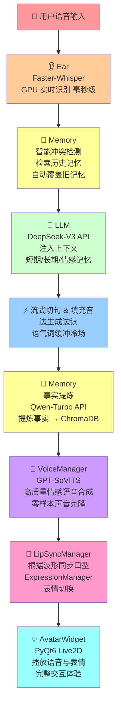
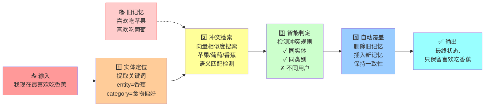

AI virtual host integrating speech recognition, LLM, memory system, and voice synthesis.
::github{repo="Vedaru/Local-project"}

# Local: 基于 DeepSeek 与 混合架构的 AI 虚拟主播系统

Local 是一个集成了语音识别 (ASR)、大语言模型 (LLM)、长期记忆系统 (RAG) 以及高质量语音合成 (TTS) 的人工智能虚拟主播系统。本项目旨在构建一个类似 Neuro-sama 的数字生命，通过本地算力与云端 API 的混合驱动，实现在低延迟环境下的高智能互动。

## 🚀 技术架构 (Technical Stack)

本项目采用“云端大脑 + 本地感官”的混合架构，充分发挥 RTX 5060 显卡的本地推理能力：

*   **大脑 (Brain):** [DeepSeek-V3 (API)](https://www.deepseek.com/)
    *   负责核心对话逻辑、人设演绎及直播间互动。
*   **听觉 (Ear):** [Faster-Whisper (Local)](https://github.com/SYSTRAN/faster-whisper)
    *   基于本地显卡加速的语音转文字，实现毫秒级的语音指令接收。
*   **嘴巴 (Voice):** [GPT-SoVITS (Local)](https://github.com/RVC-Boss/GPT-SoVITS)
    *   本地部署的高质量情感语音合成，支持零样本声音克隆。
*   **记忆秘书 (Analyst):** [Qwen-Turbo (API)](https://help.aliyun.com/zh/model-studio/)
    *   负责从对话流中提炼关键事实，将短期记忆转化为结构化信息。
*   **长期记忆 (Memory):** [ChromaDB (Local)](https://www.trychroma.com/)
    *   本地向量数据库，存储海量历史对话事实，实现“永不忘记”的互动体验。
*   **身体 (Avatar):** [Live2DViewerEX](https://store.steampowered.com/app/616720/Live2DViewerEX/)
    *   跨平台的虚拟形象驱动端，支持桌面挂件模式与 API 联动。

## 🛠️ 核心机制 (Key Mechanisms)

### 1. 记忆双轨制 (Memory Pipeline)
系统通过双层架构管理记忆：
- **短期记忆:** 维护最近 15 轮对话的上下文窗口。
- **长期记忆:** 当对话窗口溢出时，触发 `Qwen-Turbo` 提炼事实，并存入 `ChromaDB`。在回答前，系统会自动检索相关事实并注入 `DeepSeek-V3` 的提示词中。

### 2. 低延迟响应流
为了消除 AI 思考时的冷场，本项目实现了：
- **流式切句:** 实时检测 DeepSeek 输出的标点符号，实现“边想边读”。
- **填充音机制:** 在 API 请求期间随机播放“嗯...”、“我想想”等语气词音频。

### 3. 桌面联动
利用 Live2DViewerEX 的远程控制功能，AI 可以根据情绪标签（如 `[开心]`）自动切换表情，并实现在桌面上的置顶透明显示。

## 💻 硬件要求
显卡: NVIDIA GeForce RTX 5060 (笔记本版 8GB 显存) 或更高。
环境: CUDA 12.1 + cuDNN 8.9.x。
系统: Windows 10/11。
Python: 3.8+

---

## 📦 项目结构详解

### 核心模块 (modules/)

#### 1️⃣ **ear.py - 听觉模块**
```
功能: 实时语音识别 (ASR)
实现:
  - 基于 PyAudio + Faster-Whisper 的语音输入
  - 支持 CUDA 加速 (float16 精度)
  - 集成 RMS 静音检测 (VAD)
  - 支持内存处理或临时文件存储
特点:
  - 毫秒级延迟的实时转写
  - 自动噪声过滤
  - 支持多种语言识别
```

#### 2️⃣ **llm.py - 大脑模块**
```
功能: 对话逻辑生成与记忆上下文注入
实现:
  - 调用 DeepSeek-V3 API (OpenAI 兼容格式)
  - 支持最多 2 次重试机制
  - 自动规范化文本输入
  - 将短期/长期/情感记忆注入系统提示词
特点:
  - 低延迟 API 响应处理
  - 自动异常重试
  - 记忆感知的智能回复
```

#### 3️⃣ **voice.py - 语音合成模块**
```
功能: 文本转语音 (TTS) 与音频播放
实现:
  - 集成 GPT-SoVITS 本地模型
  - 支持零样本声音克隆
  - 多线程 TTS 队列处理 + 音频播放
  - 低延迟配置 (256 样本缓冲)
特点:
  - 双队列设计: 文本队列 → 音频队列 → 播放
  - 预热机制减少首句延迟
  - PyAudio 流式输出 (32kHz)
  - 情感语调支持
```

#### 4️⃣ **memory/ - 人类化长期记忆系统**
```
结构:
  ├── core.py (HumanLikeMemory & MemoryManager)
  ├── conflict.py (冲突检测与自动覆盖)
  ├── storage.py (ChromaDB 向量数据库交互)
  ├── retrieval.py (语义检索与去重)
  ├── analyzers.py (实体提取、情感分析)
  └── config.py (记忆配置参数)

核心特性:
  - 四层记忆架构:
    1. 短期记忆: 最近 15 轮对话上下文
    2. 工作记忆: 当前会话的核心事实
    3. 长期记忆: ChromaDB 向量数据库存储
    4. 情感记忆: 用户偏好与情绪标签

  - 智能冲突检测 (四步流程):
    1. 实体定位: 提取对话中的关键词(如"食物"、"电影")
    2. 冲突检索: 基于向量相似度 + 语义匹配
    3. 智能判定: 应用规则判断是否存在冲突
    4. 自动覆盖: 物理删除旧记忆，插入新记录

  - 同类偏好自动覆盖: 
    - 用户说"现在喜欢吃香蕉"时自动删除"喜欢吃苹果"
    - 基于实体类型(category)进行去重
    - 保留最新的用户偏好

  - 并行检索与去重:
    - 多线程检索历史记忆
    - 自动去除重复或相似的记忆片段
```

#### 5️⃣ **avatar/ - 虚拟形象驱动系统**
```
结构:
  ├── widget.py (PyQt6 WebEngine 渲染窗口)
  ├── manager.py (线程安全的 Avatar 控制器)
  ├── lip_sync.py (口型同步)
  ├── expression.py (表情切换: Emotion 枚举)
  ├── js_communication.py (JS-Python 双向通信)
  ├── click_through.py (穿透点击功能)
  ├── tray.py (系统托盘集成)
  └── resize.py (窗口自适应)

功能:
  - 集成 Live2D 模型渲染 (通过 WebEngine)
  - 表情系统: 开心、生气、害羞、中立等情感标签
  - 实时口型同步: 根据音频波形调整口形
  - 桌面挂件模式: 置顶透明窗口
  - 系统托盘控制: 最小化/显示/退出
  - 点击穿透: 允许与背景应用交互
```

#### 6️⃣ **config.py & logging_config.py - 配置与日志**
```
配置项:
  - ARK_API_KEY: DeepSeek 或其他 LLM API 密钥
  - SOVITS_URL: GPT-SoVITS 服务地址 (默认 http://127.0.0.1:9880)
  - REF_AUDIO: 参考音频路径 (用于语音克隆)
  - PROMPT_TEXT: 参考音频对应的文本
  - MODEL_NAME: LLM 模型名称 (如 deepseek-chat)
  - SYSTEM_PROMPT: 系统提示词 (定义 AI 人设)
  - GPT_SOVITS_PATH: GPT-SoVITS 本地路径

日志:
  - 按模块分类 (ProjectLocal.Ear, ProjectLocal.LLM, etc.)
  - 输出到 data/logs/ 目录
  - 调试级别可配置
```

### 入口文件 (main.py)

```python
核心类:
  - AIWorkerSignals: 定义 AI 工作线程与 GUI 的 Qt 信号
  - EarWorker: 麦克风监听线程，实时识别语音
  - AIWorker: 主 AI 处理线程 (对话/记忆/语音合成)

工作流:
  1. EarWorker 监听麦克风 → 输出文本
  2. AIWorker 接收文本 → 检索记忆 → 调用 LLM
  3. LLM 返回响应 → 提炼记忆事实 → 存入 ChromaDB
  4. VoiceManager 合成语音 → 播放音频
  5. AvatarManager 同步表情与口型 → 完整互动
```

### 依赖项配置 (requirements.txt)

核心依赖:
- **openai**: LLM API 调用 (支持 DeepSeek)
- **chromadb**: 向量数据库存储与检索
- **faster-whisper**: GPU 加速语音识别
- **pyaudio**: 音频输入输出处理
- **PyQt6**: 桌面 GUI 框架
- **PyQt6-WebEngine**: Live2D 模型渲染
- **jieba**: 中文分词 (记忆提炼使用)
- **pyyaml**: 配置文件解析

---

## 🔄 工作流详解

### 完整交互流程



### 记忆系统的四步冲突检测

**以用户更新"食物偏好"为例:**



---

## 🚀 快速开始

### 1. 环境配置

```bash
# 克隆项目
git clone <repo-url>
cd Local-project

# 创建虚拟环境(可选)
python -m venv venv
# Windows: venv\Scripts\activate
# Linux/Mac: source venv/bin/activate

# 安装依赖
pip install -r requirements.txt
```

### 2. API 密钥配置

创建 `.env` 文件:
```
ARK_API_KEY=your_deepseek_api_key
SYSTEM_PROMPT=你是一个名叫Local的AI虚拟主播,性格活泼开朗。
MODEL_NAME=deepseek-chat
GPT_SOVITS_PATH=./GPT-SoVITS-v2pro-20250604-nvidia50
```

### 3. 启动 GPT-SoVITS 服务

```bash
cd GPT-SoVITS-v2pro-20250604-nvidia50
python api.py  # 启动 TTS 服务于 http://127.0.0.1:9880
```

### 4. 运行主程序

```bash
python main.py
```

输入模式:
- **普通输入**: 输入文本开始对话
- **exit/quit**: 退出程序
- **status**: 查看记忆系统状态

---

## 🎯 高级特性

### 低延迟设计
- **流式切句**: 实时检测标点符号，边生成边播放
- **填充音机制**: API 响应期间播放语气词 ("嗯..."、"让我想想...")
- **预热机制**: TTS 启动时预热模型减少首句延迟
- **小缓冲区**: 256 样本缓冲 (32kHz 采样率) 实现最低延迟

### 人类化记忆
- **遗忘曲线**: 历史记忆根据时间衰减，模拟真实遗忘过程
- **情感权重**: 高情感对话优先保留
- **去重机制**: 检测和删除重复/相似的记忆片段
- **冲突覆盖**: 自动处理记忆矛盾，保持一致性

### Avatar 交互
- **表情系统**: 开心 😊 / 生气 😠 / 害羞 😳 / 中立 😐 等多种情感
- **口型同步**: 根据音频波形精确同步口形
- **桌面挂件**: 置顶透明窗口，支持穿透点击
- **系统托盘**: 最小化/显示/快速退出

---

## 📊 关键配置参数 (config.yaml)

```yaml
# API 配置
api:
  ark_api_key: ""  # 从 .env 读取
  sovits_url: "http://127.0.0.1:9880"

# 音频配置
audio:
  ref_audio_path: "assets/audio_ref/ref_audio.wav"
  prompt_text: "大家好，我是虚拟歌手洛天依..."
  sample_rate: 32000

# 记忆配置
memory:
  data_dir: "data/chroma_db"
  collection_name: "seeka_memory"
  
# 日志配置
logging:
  log_dir: "data/logs"
```

---

## 💡 技术亮点

1. **混合架构优化**: 充分利用本地 GPU，仅在关键环节调用云端 API
2. **模块化设计**: 每个功能独立实现，易于扩展和维护
3. **实时性能**: 毫秒级语音识别，秒级对话响应
4. **人性化交互**: 流式对话、情感表达、长期记忆
5. **完全本地化**: 无需依赖商业云服务，数据隐私有保障