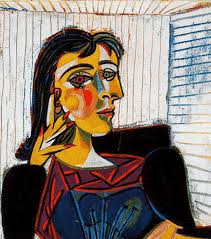

# 故事的开始（万恶之源？

我入坑VOCALOID的第一首术曲是Orangestar的明日的夜空哨戒班，但是这并不是我听过的第一首术曲。  

我听的第一首术曲还得回溯到我初三的时候，那时候我对ヨルシカ（夜鹿）这个组合非常感冒，这个组合让我最欲罢不能的就是编曲n-buna（拿不拿）的那种夏日的忧郁感（想不到吧我也是推拿师hiahia，当然suis唱的也是一级棒啊~❤）。ヨルシカ的歌听差不多了的时候我就网上查看n-buna有没有别的歌。然后我就找到了拿不拿的两张术专。

但是其实这个时候我还不知道术曲这个概念，我只是单纯觉得这两张专辑很有拿味而且很有特色，miku（当然那个时候我还不知道她叫miku）的那种晶莹透亮的机械音把那种夏日的忧郁很好地传达了出来。关于这两张专辑更多的内容可以看

后来ヨルシカ和n-buna的歌都听差不多了我就继续寻找“有日系夏日味道”的歌（其实这个时候已经深陷其中了😭），偶然间我又听到了Orangestar的明日的夜空哨戒班。我发现“嘶~，这哨戒班和之前拿不拿两张专辑风格挺像的”，查了一下发现原来这就叫术曲……

---

# 我对于VOCALOID的理解

n-buna的两张术专和Orangestar的哨戒班给我的冲击并不只限于听感，它们在很长的一段时间上也影响着我对于术曲的理解。（以下是个人观点，看个乐子得了😛）  

拿不拿两张术专虽然歌手并不是真人，但是歌曲中包含的情感、歌曲和专辑本身的完成度，都不输于拿不拿在夜鹿时期创作的歌曲。这不禁让我开始思考：决定歌曲所传达的情感的，究竟是何种因素？  

| &nbsp; | &nbsp; |
|---|---|
|  | 如果一张画像被解构，仅保留最基本的线条与色彩，画师依然可以通过这些简练的线条传递画中人物的形、神、甚至是作画的意图。在我看来vocaloid象征着音乐家对于人的歌声的解构，就像画家将光影形态转化为简练的线条色块，p主将原本复杂多变的歌声具象化为参数，将模糊的感情符号化。这样的创作过程是及其深邃的，唯有创作者本人的情感强烈到一定程度才能完成这样繁琐细腻的工作。 |

“烹饪美味的菜肴往往只需要使用简单的食材。”  
简单的十几种参数、有限数量的采样，使用这些看似有限的创作条件往往更能促使创作者贯彻“大道至简”的哲学，创作出真正的天籁之音。